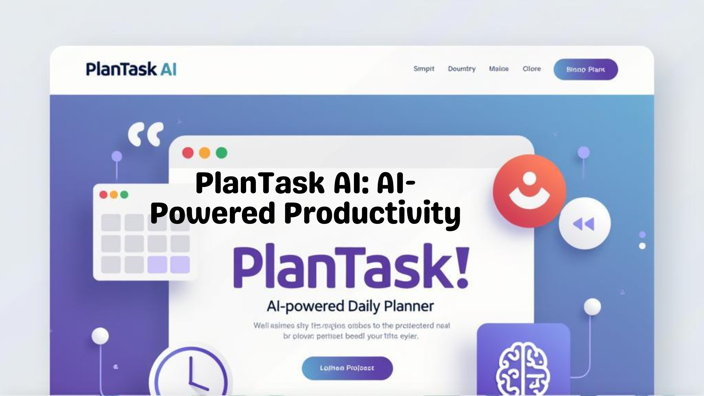

# 📅 PlanTask AI  

<p align="center">
  
</p>

<p align="center">
  
  
  
  
  
</p>


**PlanTask AI** is an open-source, AI-powered daily planner designed for **students and early-career professionals**.  
It helps you manage **studies, projects, and career growth** by generating adaptive daily schedules.  

If you miss a task, PlanTask AI automatically **reschedules and reprioritizes**, so you stay on track without the overwhelm.  

---

## ✨ Features
- 📝 Add tasks with title, duration, priority, and deadline  
- ⏱ Generate a realistic daily schedule with time blocks  
- 🔄 Reschedule missed tasks to the next day  
- 🎯 Mark tasks as complete  
- 📊 (Coming soon) Daily reflections and AI-powered task breakdowns  

---

## 🛠 Tech Stack
- **Python 3.9+**  
- **JSON** for local task storage  
- (Future) OpenAI API for natural input & smart planning  
- (Future) FastAPI + React for web app  

---

## 🚀 Roadmap
- [x] CLI MVP — task input, scheduling, mark complete  
- [ ] Smart rescheduling for missed tasks  
- [ ] AI integration (natural input, task breakdowns)  
- [ ] FastAPI backend  
- [ ] Web UI (React/Streamlit)  
- [ ] Integrations (Google Calendar, Notion)  

---

## 📂 Project Structure
```bash
plantask-ai/
├── planner.py # Core CLI logic
├── tasks.json # Task storage
├── requirements.txt # Dependencies
├── .gitignore # Ignore unnecessary files
├── LICENSE # MIT license
└── README.md # Project documentation
```

## Installation

### 1. Clone the repository:
```bash
git clone https://github.com/YOUR-USERNAME/plantask-ai.git
cd plantask-ai
```

### 2. Create virtual environment(optional but recommended)
```bash
python -m venv venv
source venv/bin/activate   # Linux/Mac
venv\Scripts\activate      # Windows
```

### 3. Install dependencies
```bash
pip install -r requirements.txt
```
### 4. Run the planner
```bash
python planner.py
```

### Sample interaction:
```bash
1. Add task
2. View tasks
3. Mark task as done
4. Exit
```


## 🤝 Contributing
Contributions are welcome!

1. Fork the project
2. Create a new branch (git checkout -b feature/your-feature)
3. Commit changes (git commit -m "Add new feature")
4. Push to your fork and submit a Pull Request


## 📜 License
Distributed under the MIT License. See LICENSE for details.

## ⭐ Acknowledgments

[Shields.io] for badges
[Canva] for the project banner
The open-source community 💙